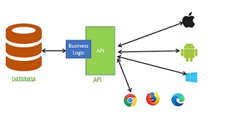

# On12-s8-ProjetoGuiado-GET
Turma Online 12 | Back-end | 2021 | Projeto Prático com API - Método: GET

Nesta semana , estudamos os diretório de um mini  projeto, e entendemos como cada estrutura funciona .

 **Node.js** pode ser definido como um ambiente de execução Javascript server-side. Interpretador javaScript que não precisa de navegador , 
 conectar com um banco de dados , se comporta como servidor, ler e escreve
 arquivos no computador.

   **NPM** (Node Package Manager) é o gerenciador de pacotes do Node.js . Ele permite instalar, desinstalar e atualizar dependências em uma aplicação por meio de uma simples instrução na linha de comando.

   **package.json** – Todas as informações do projeto e suas dependências são contempladas neste arquivo, tal como, o nome do projeto, versão, autor, licença, e dentre várias outras informações. (Links);

   **package-lock.json** é gerado automaticamente para qualquer operação em que o npm modifique a árvore node_modules ou o package.json. Ele descreve a árvore exata que foi gerada, de forma que as instalações subseqüentes possam gerar árvores idênticas, independentemente das atualizações intermediárias de dependência.

   **node_modules** – Diretório onde todas as dependências ficam alocadas;

   **Express**- é um Framework para o desenvolvimento de aplicações JavaScript com o Node.js foi desenvolvido para otimizar a construção de aplicações web e APIs, tornando-se um dos Frameworks mais populares da internet e que utiliza o Node para execução do javascript como linguagem de back-end.

  **Nodemon**, esse módulo é um utilitário que irá monitorar todas as alterações nos arquivos de sua aplicação e reiniciar automaticamente o servidor quando for necessário.

  

### Agora vamos falar de como funciona uma API na prática.

 Primeiro ponto que precisa ser esclarecido, quando falamos de APIs toda a comunicação dessa interface é feita via web, ou seja, tudo é feito através de uma requisição a uma URL, que por sua vez, traz uma resposta.                  

### Entendendo uma requisição

* O endpoint

A URL nada mais é que o caminho para fazer a requisição, porém é interessante ressaltar que ela segue a seguinte estrutura:

* Base URL

Esse é o início da URL da requisição, aqui você basicamente falará a informação de domínio que se repete em qualquer requisição. Por exemplo:

https://api.minhagastronomia.com

* Resource ou Path

O recurso é o tipo de informação que você está buscando, ou seja, vamos simular que estamos buscando saber sobre vinhos, então acrescentamos o recurso vinhos:

https://api.minhagastronomia.com/vinhos

* Query String

A query string são os parâmetros daquela requisição, então, se eu quisesse saber os melhores vinhos da região sul do Brasil, eu incluiria esses parâmetros ?pais=brasil&regiao=sul e nossa URL ficaria assim:

https://api.minhagastronomia.com/vinhos?pais=brasil&regiao=sul

Como podem ver acima, por se tratar de parâmetros da URL você usa o (?) e caso queira utilizar mais de um parâmetro você utiliza o (&).

OBS: A Query String não é somente utilizada para filtros, ela pode ser utilizada como parâmetros de paginação, versionamento, ordenação, e muito mais.

### O método

O método te ajuda a informar o tipo de ação que você está fazendo naquela requisição.

Dentre os principais métodos, temos:

* Get (Buscar dados)
* Post (Enviar dados)
* Put e Patch (Atualizar dados)
* Delete (Deletar dados)

### Headers

Headers ou cabeçalhos permitem que você envie informações adicionais na requisição. Ele pode ser utilizado para inúmeras funções, como: autenticação, formatação de objeto, e muito mais.
Para utilizá-lo é simples você coloca a propriedade, seguido dois pontos e o valor, tudo entre aspas, exemplo:

"Authorization: token123242343534".

### Body

O body é o corpo da mensagem que você quer enviar na requisição. Ele é utilizado somente nos métodos de **POST**, **PUT**, **PATCH**, ou seja, ele contém o dado a ser processado pela API, e por isso ele não é necessário em métodos de leitura de dados.

### HTTP Status Codes

Para facilitar o entendimento das respostas das APIs existem padrões de códigos de status que podem ser utilizados.

Os códigos mais utilizados para as respostas de uma requisição são o 200 (OK), o 201 (created), o 204 (no content), o 404 (not found), o 400 (bad request), e 500 (internal server error).

### Autenticação

Obviamente não podemos falar de APIs sem segurança, afinal estamos falando da WEB.

Como principais métodos de autenticação de APIs, temos:

* Basic authentication

Baseado em usuário e senha codificados em Base64 e utilizado no header da requisição.

* Secret token

Token de acesso que pode ser limitado a escopo, e que é enviado na requisição pelo Header ou pela Query String.

Nesse caso temos padrões famosos como oAuth e JWT.

### Referências :

 [A anatomia de uma API RESTful] disponível em: ( https://thiagolima.blog.br/a-anatomia-de-uma-api-restful-80df2aca158e ) Acessado em: 14 de julho de 2021.

 ### EXERCÍCIO PARA CASA
- Usar um arquivo json (ou de series ou da pasta extra/)
- Configurar uma API na arquitetura MVC do zero
    - Pasta raiz com arquivos de configuração
    - Instalar as dependências que preciso (express e nodemon)
    - Criar pasta src
        - Criar pastas (controllers, routes e models)
        - Criar arquivos dentro de cada pasta
    - Iniciar o servidor
    - Configurar o app.js
    - Configuro rotas
    - Configura as lógias (controllers)
        - Trazer tudo do json
        - Trazer filtrado titulo
        - Trazer filtrado por id
    - Ir rodando e testando no postman (:

